This is a real time blood donation alert app that was created using React Native, Node.js, and MongoDB.
There are 2 types of users of this app: donors and recipients.
The recipient can be a hospital/blood bank, and the donor can be any person.
The recipient can generate a request from their device for a certain blood type, and any donor with a matching or compatible blood type who lives within the vicinity (within 2-3 KM) gets alerted about the emergency via a push notification service (Expo Notifications) and can proceed to the location to donate their blood.

Here are some of the screenshots of our project-

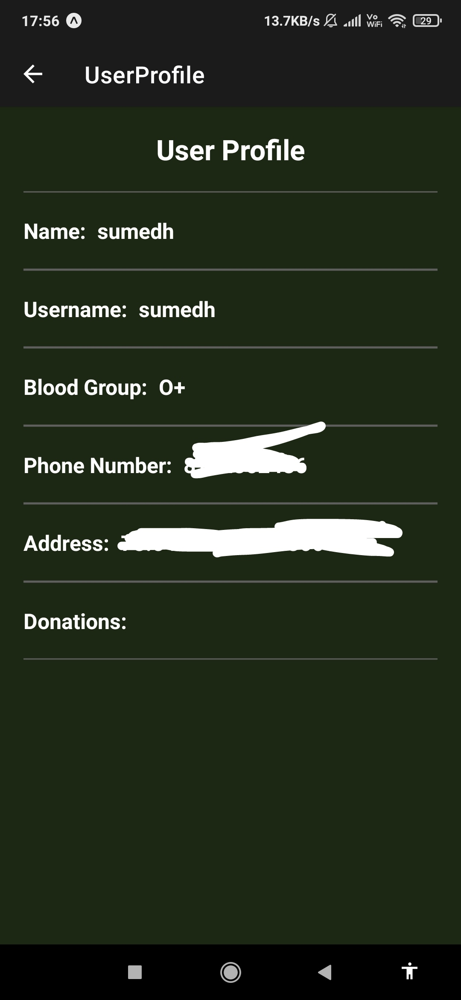
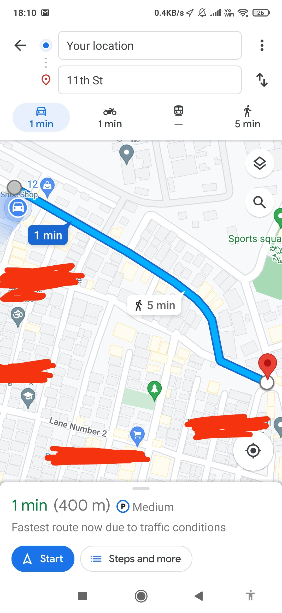
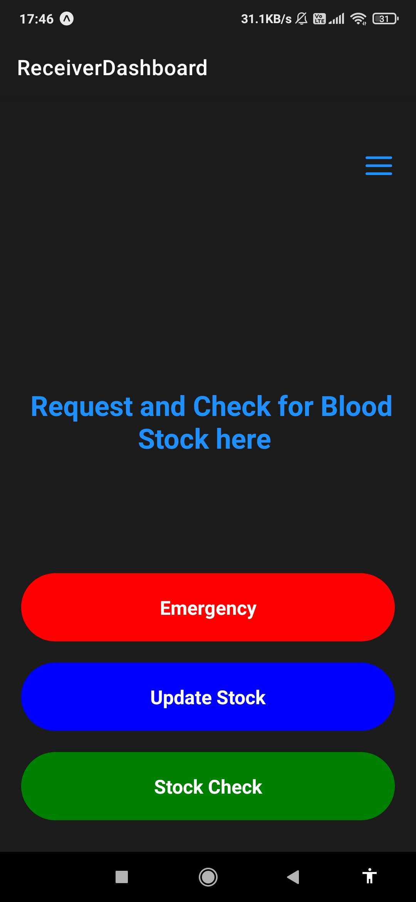
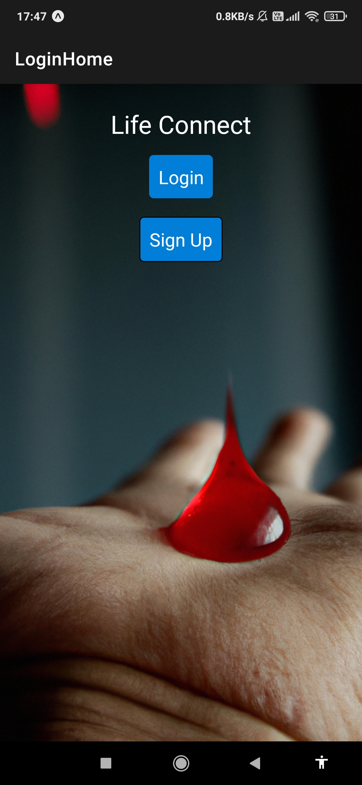
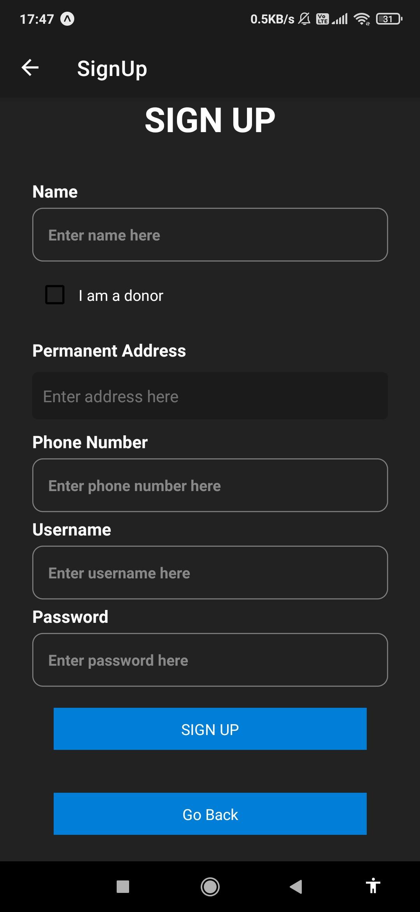
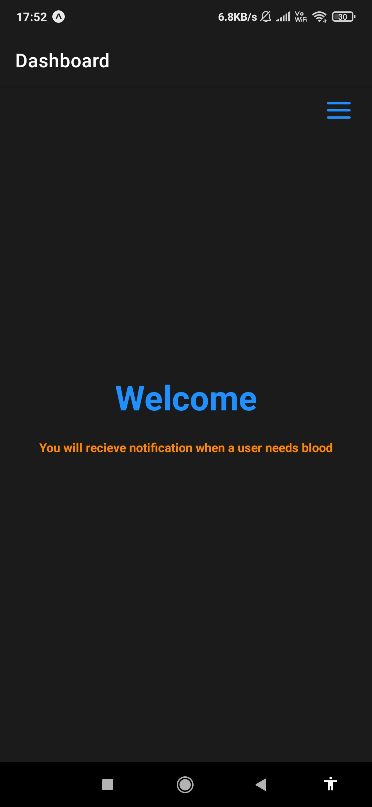
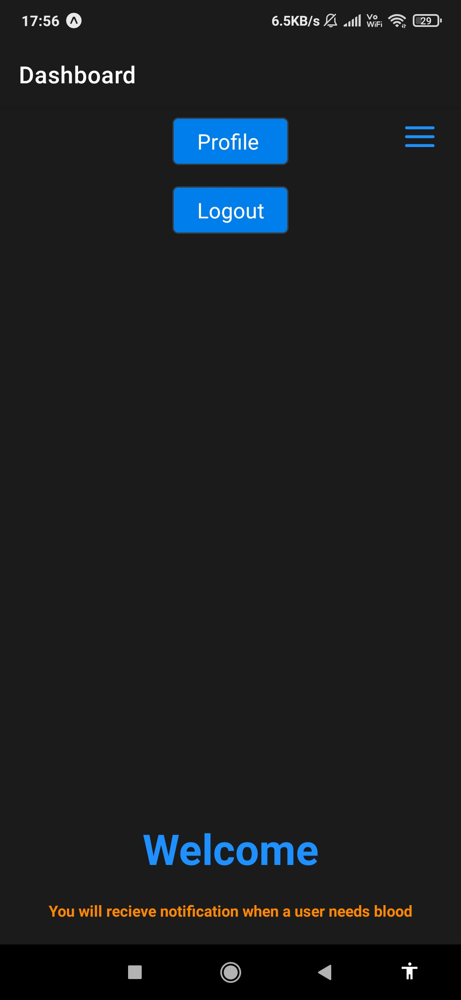
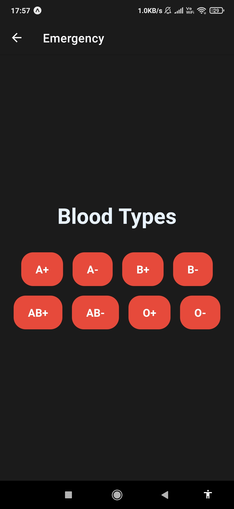
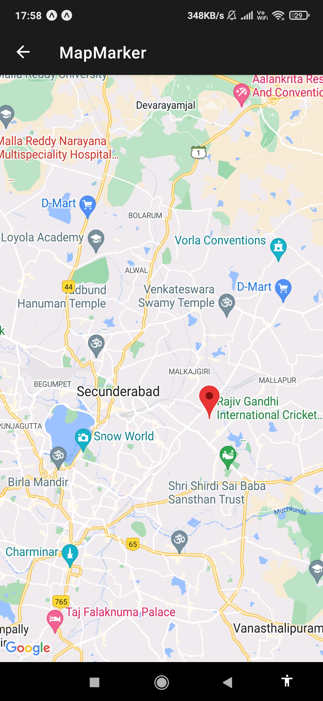
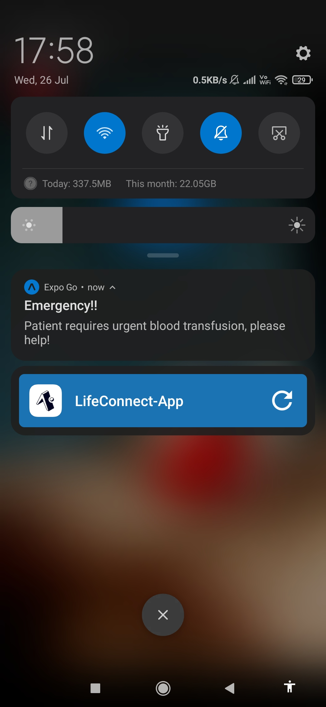
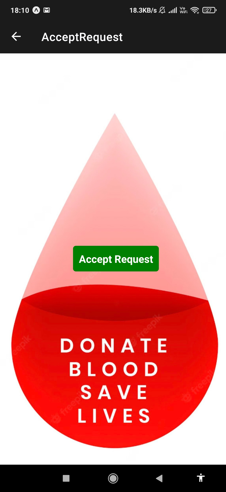
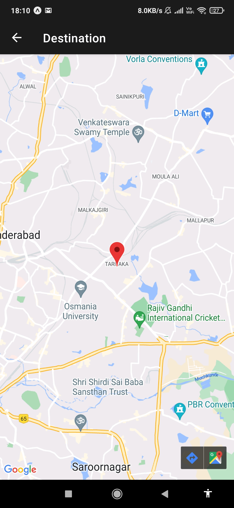
